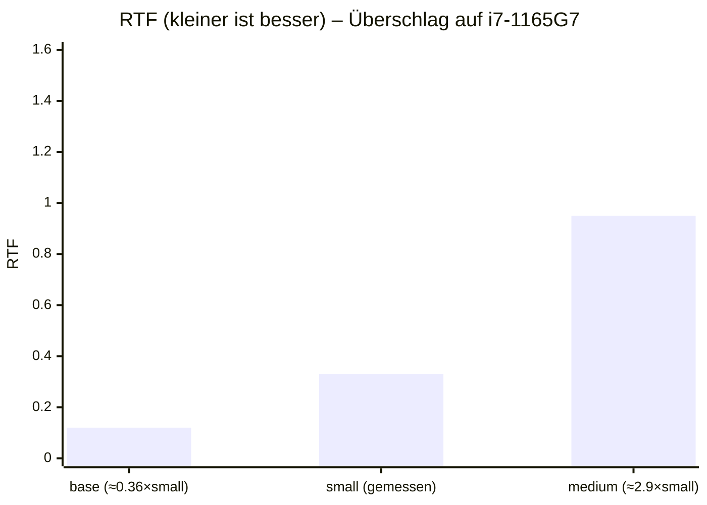

# Bestes whisper.cpp-kompatibles STT‑Modell für Deutsch und Englisch auf Notebook‑CPU

## Executive Summary

Für eine typische Office‑Notebook‑CPU (Intel i5/i7 U‑Serie oder AMD Ryzen 5/7 Mobile, CPU‑only) ist **Whisper “small” als quantisiertes ggml‑Modell (praktisch: `ggml-small-q5_1.bin`)** in den meisten Fällen der beste Kompromiss aus **Tempo, Speicherbedarf und “gut bis sehr gut” Erkennungsqualität** für **Deutsch und Englisch**. Das Modell bleibt deutlich unter 1 GB RAM‑Klasse (in Vollpräzision ~852 MB) und ist als Quant‑Variante deutlich kleiner auf Disk (z. B. ~181 MiB). citeturn35view1turn34view0

Wenn du **spürbar bessere Qualität** willst und dein Notebook die zusätzliche Rechenlast verkraftet, ist **`ggml-medium-q5_0.bin`** die naheliegende “Qualitäts‑Stufe”: In FLEURS sinkt der WER für Deutsch (multilingual) von **10,2% (small)** auf **6,5% (medium)**; für Englisch von **6,1%** auf **4,4%**. citeturn16view4  
Leistungsmäßig ist “medium” typischerweise etwa **~3× langsamer als “small”** (Faustwert aus OpenBenchmarking‑Daten derselben Teststrecke), wodurch es je nach CPU **knapp bis stabil echtzeitfähig** sein kann. citeturn31search5turn23view1

Wenn “sehr gut” Priorität hat, aber du **nicht** die volle “large”‑Schwere willst, ist **`ggml-large-v3-turbo-q5_0.bin`** die spannendste Option: Der “turbo” ist laut entity["organization","OpenAI","ai research org"] eine optimierte Variante von `large-v3` mit nur **4 Decoder‑Layern statt 32**, ausgelegt auf deutlich höhere Transkriptionsgeschwindigkeit bei nur kleiner Genauigkeitsverschlechterung und in vielen Sprachen “ähnlich large‑v2”. citeturn37view1turn13view0  
Er ist aber (trotz Quantisierung) weiterhin ein “Large‑Klasse”‑Modell in der Praxis: konsequent CPU‑only auf leichten U‑CPUs kann thermisch/energetisch und von der Latenz her anspruchsvoll werden.

## Modelllandschaft und Qualitätsanker für Deutsch und Englisch

Whisper‑Modelle skalieren klassisch über **tiny → base → small → medium → large**: Größer bringt im Mittel weniger Fehler, kostet aber überproportional Rechenzeit und Energie. whisper.cpp nutzt Whisper‑Gewichte im eigenen `ggml`‑Binärformat und stellt die Modellgrößen mit groben RAM‑Bedarfen in der Doku dar (Vollpräzision): tiny ~273 MB, base ~388 MB, small ~852 MB, medium ~2,1 GB, large ~3,9 GB. citeturn35view1

Für **Deutsch+Englisch** ist die wichtigste Weiche: **multilingual** statt **`.en`**. Die `.en`‑Modelle sind auf Englisch optimiert und für Deutsch nicht die richtige Wahl, wenn du beides brauchst. (In der Praxis kann man zwar Language‑ID und “fallback” bauen, aber du wolltest explizit “Deutsch und Englisch” gut abdecken.)

### WER‑Orientierung (Deutsch/Englisch) aus der Whisper‑Evaluation

Als belastbarer Qualitätsanker eignen sich die im Whisper‑Paper veröffentlichten WER‑Tabellen für multilingual Speech Recognition. Für **FLEURS** (sauberere, eher “studioähnliche” Aufnahmen) liegen die WER‑Werte für Deutsch/Englisch über die Modellgrößen beispielhaft bei: **Deutsch** tiny 27,8 → base 17,9 → small 10,2 → medium 6,5 → large 5,5 (large‑v2 4,5) und **Englisch** tiny 12,4 → base 8,9 → small 6,1 → medium 4,4 → large 4,5 (large‑v2 4,2). citeturn16view4  
Das ist genau das Muster, das die Praxis bestätigt: small ist “gut”, medium ist “sehr gut”, large ist nochmal besser – aber mit deutlich steigendem Rechenaufwand.

Auch auf MLS (Multilingual LibriSpeech) zeigt sich der gleiche Trend; z. B. sinkt Deutsch‑WER von 10,5 (small) auf 7,4 (medium) und 6,6 (large). citeturn16view0

### “large‑v3” und “large‑v3‑turbo” (für hohe Qualität bei besserer Geschwindigkeit)

Whisper `large-v3` bringt laut OpenAI gegenüber `large`/`large‑v2` nur kleine Architekturänderungen (u. a. 128 Mel‑Bins statt 80) und ist auf sehr viel zusätzlichem Audio trainiert (u. a. 1 Mio. Stunden weakly labeled + 4 Mio. Stunden pseudo‑labeled), mit berichteten **10–20% Fehlerreduktion** gegenüber `large‑v2` über viele Sprachen (Common Voice 15 & FLEURS, teils CER statt WER). citeturn37view0

Der `large-v3-turbo` (“turbo”) ist wiederum eine speed‑orientierte Variante von `large-v3` mit stark reduziertem Decoder (4 Layer) und wird als **“ähnlich `large‑v2` über Sprachen”** beschrieben; auf **FLEURS (clean)** typischerweise besser als auf Common Voice (noisier). citeturn37view1turn13view0  
Für Deutsch/Englisch (beides “High‑resource” relativ gesehen) ist das häufig ein sehr attraktiver Sweet Spot – vorausgesetzt, dein Notebook kann die Encoder‑Last stabil tragen.

## Performance auf typischen Office‑Notebook‑CPUs

### CPU‑Features und was real zählt

whisper.cpp ist explizit auf CPU‑Inferenz optimiert und nutzt SIMD‑Instruktionen, wenn vorhanden (x86 AVX/AVX2 usw.). In der README wird AVX‑Intrinsics‑Support genannt, und Laufzeit‑Logs zeigen, dass `system_info` u. a. **AVX/AVX2/AVX512/FMA/SSE3** ausgibt. citeturn33view0turn35view0  
Praktisch bedeutet das:

- **AVX2 + FMA** ist der Performance‑“Normalfall” bei halbwegs modernen Notebooks.
- Ohne AVX2 (sehr alte Geräte, manche Low‑Power/Atom‑Klassen) sinkt der Durchsatz stark – dann ist “small” oft schon das Maximum, wenn Echtzeit wichtig ist.

OpenBenchmarking‑Resultate zeigen zudem reale Build‑Flags, die typischerweise CPU‑Features aktivieren (z. B. `-msse3 -mavx -mfma -mavx2 …` bis hin zu AVX‑512, wenn verfügbar). citeturn31search5

### Realtime‑Factor (RTF) als zentrale Kennzahl

Im ASR‑Alltag ist der **Realtime‑Factor (RTF)** die wichtigste “System‑Kennzahl”:  
RTF = (Verarbeitungszeit) / (Audiolänge). **Kleiner ist besser**, RTF < 1 ist schneller als Echtzeit.

Für eine nachvollziehbare Referenz nutze ich OpenBenchmarking‑Daten mit Whisper.cpp und dem Input “2016 State of the Union” (ein definierter, reproduzierbarer Workload). citeturn20view0turn27view0  
Die Rede ist als 58‑minütig dokumentiert; als Näherung setze ich daher **~3480 s Audiolänge** an. citeturn24search7

**Beispielwerte (Whisper.cpp 1.6.x, Modell `ggml-small.en`, CPU‑only):**
- **Intel i7‑1165G7**: ~1139 s → **RTF ~0,33** (≈3× schneller als Echtzeit) citeturn23view1turn24search7  
- **Intel Core Ultra 7 155H**: ~1347 s → **RTF ~0,39** citeturn23view4turn24search7  
- **Intel i5‑1334U**: ~1915 s → **RTF ~0,55** citeturn23view1turn24search7  
- **AMD Ryzen 7 4700U**: ~791 s → **RTF ~0,23** citeturn23view5turn24search7  

Diese Zahlen sind **für `small.en`**; für das **multilinguale `small`** ist die Rechenlast sehr ähnlich (Modelldimensionen sind gleich), sodass das als pragmatische Performance‑Nähe taugt – mit dem Hinweis, dass Audio‑Charakteristik, Threads, BLAS‑Build, OS‑Scheduler und Thermik die RTF in der Realität spürbar verschieben können. citeturn27view0turn35view1

### Skalierung über Modellgröße (Base/Small/Medium) – Faustfaktor aus derselben Teststrecke

Ein hilfreicher Skalierungsanker ist ein OpenBenchmarking‑Resultat, das **base/small/medium** auf demselben System für denselben Input zeigt. Dort liegen die Gesamtzeiten etwa bei **base ~81 s**, **small ~225 s**, **medium ~649 s** (für den 58‑min‑Input). citeturn31search5turn24search7  
Daraus folgt als grobe Faustregel:

- **base ≈ 0,36 × small** (≈2,8× schneller als small)
- **medium ≈ 2,9 × small** (≈3× langsamer als small)

Damit kannst du für dein Notebook schnell “überschlagen”:

- Wenn `small` bei dir z. B. RTF ~0,33 schafft, ist `medium` eher bei **~0,95** (knapp echtzeitfähig) und `base` bei **~0,12** (sehr schnell). citeturn31search5turn23view1

### Multi‑Threading‑Skalierung und Praxis‑Limits

Mehr Threads helfen, aber nicht linear: Speicherbandbreite, Cache‑Effekte und Encoder‑Dominanz sorgen für abnehmenden Grenznutzen. Das kann man an bench‑Ergebnissen sehen (z. B. bei “small” sinkt die Encode‑Zeit deutlich von 1→4 Threads, aber weniger stark von 4→8 Threads). citeturn9view0

OpenBenchmarking bewertet die Settings (für small.en) außerdem als “generally scale well with increasing CPU core counts” und zeigt eine Core‑Scaling‑Kurve. citeturn25view3turn27view0

### Energie und Thermik auf Notebooks (warum “small” oft der Sweet Spot ist)

Auf einem Notebook ist Sustained‑Compute entscheidend: Whisper‑Transkription ist ein **dauerhaft hoher, parallelisierbarer CPU‑Workload**. In der Praxis heißt das:

- Mehr Threads → mehr kurzzeitiger Durchsatz, aber auch schnelleres Erreichen von TDP‑Limits → mögliche **Taktreduktion** → schwankende Latenz/RTF.  
- “medium” kann in Meetings/Long‑Form‑Audio dazu führen, dass der Laptop dauerhaft “heiß läuft” und die RTF am Ende schlechter wird als am Anfang, wenn dein Gerät aggressiv drosselt (das ist weniger ein Whisper‑Problem als Laptop‑Thermik‑Design).

Die Stabilität (und damit UX) ist häufig mit “small (quantisiert)” besser als mit “medium (Vollpräzision)”, selbst wenn medium nominell “nur knapp” langsamer ist.

### Diagramm: RTF vs Modellgröße (Beispiel‑Notebook)

Die folgende Grafik ist ein **RTF‑Überschlag** für ein typisches Office‑Notebook (hier exemplarisch i7‑1165G7) basierend auf (a) OpenBenchmarking‑Zeit für `small.en` und (b) Skalierungsfaktoren base↔small↔medium aus OpenBenchmarking‑Daten. citeturn23view1turn31search5turn24search7



## Speicher, Modellformat und Quantisierung in whisper.cpp

### ggml‑Modelle und warum GGUF hier (noch) nicht das Ziel ist

whisper.cpp arbeitet mit Whisper‑Modellen im **`ggml`‑Format** (typisch: `ggml-*.bin`). citeturn35view0turn33view3  
Eine explizite Aussage aus der whisper.cpp‑Community ist, dass **GGUF (noch) nicht unterstützt** werde (für Whisper – unabhängig davon, dass GGUF in anderen ggml‑Ökosystemen verbreitet ist). citeturn4search3

### Disk‑Footprint (praktisch relevant für Distribution)

Ein großer Vorteil der whisper.cpp‑Welt ist die Verfügbarkeit vorgefertigter quantisierter Modelle. Beispielhafte Disk‑Größen aus dem ggerganov/whisper.cpp Modell‑Hub auf entity["company","Hugging Face","ml model hub"]: citeturn34view0

- `small-q5_1`: **~181 MiB**
- `medium-q5_0`: **~514 MiB**
- `large-v3-turbo-q5_0`: **~547 MiB**
- `large-v3-q5_0`: **~1,1 GiB**
- (Vollpräzision: `large-v3` **~2,9 GiB**, `large-v3-turbo` **~1,5 GiB**) citeturn34view0

Damit wird Distribution realistisch: “small‑q5_1” ist klein genug, um es notfalls sogar “mitzuliefern”; “medium‑q5_0” ist häufig eher “download on demand”.

### Quantisierungstypen in whisper.cpp (was unterstützt ist)

whisper.cpp unterstützt Integer‑Quantisierung und nennt explizit, dass quantisierte Modelle **weniger RAM und Disk** verbrauchen und je nach Hardware auch **effizienter** laufen können. citeturn35view1  
Als unterstützte Quantisierungsmodi wurden (historisch dokumentiert) u. a. **Q4_0, Q4_1, Q4_2, Q5_0, Q5_1, Q8_0** aufgeführt. citeturn7search3turn35view0

**Praxisempfehlung für ASR:**  
- **Q5 (Q5_0/Q5_1)** ist häufig der beste Kompromiss: deutlich kleiner als F16, meist merklich weniger Qualitätsverlust als “aggressivere” 4‑Bit‑Settings.  
- **Q8_0** ist eine konservative Option, wenn du Quant‑Qualitätsrisiken minimieren willst, aber trotzdem Disk/RAM reduzieren möchtest.

### Speicher‑/IO‑Strategie: OS‑mmap und “Buffer‑Init”

whisper.cpp bietet neben File‑Init auch die Initialisierung aus einem **Speicherpuffer** (`whisper_init_from_buffer_with_params`) sowie Varianten “no_state”, bei denen du den internen State selbst allokieren kannst. citeturn36view0turn36view2  
Für eine Go‑Desktop‑App sind zwei robuste Ansätze üblich:

1. **Einfach & portabel:** Datei lesen (`os.ReadFile`) → Buffer‑Init.  
2. **Große Modelle & wenig RAM‑Pressure:** Modell‑Datei **memory‑mappen** (OS‑mmap) → Buffer‑Init auf den gemappten Bereich (ohne Kopie). Das spart Peak‑RAM und beschleunigt oft Start/Load‑Phasen, ist aber plattformabhängiger (Windows/Unix‑APIs unterscheiden sich).

## Integration in eine plattformübergreifende Go‑Anwendung über whisper.cpp

### Integrationsentscheidung: CLI vs C‑API

whisper.cpp ist dafür gebaut, in anderem Code zu landen: Die README betont den “lightweight” Ansatz und verweist auf eine **C‑Style‑API** (Header `whisper.h`). citeturn33view0turn36view5  
Du hast praktisch zwei Wege:

**Weg A: CLI‑Wrapper (schnellster Engineering‑Pfad)**  
Du lieferst `whisper-cli` plus Modell aus und rufst per `exec.Command` auf. Das ist von Haus aus cross‑platform, solange du pro OS/Arch passende Binaries bundlest. Die README zeigt das grundsätzliche CLI‑Pattern (`./build/bin/whisper-cli -f samples/jfk.wav`) und die Modellangabe per `-m`. citeturn33view0turn35view0

**Weg B: Native Einbettung über C‑API (beste Kontrolle/Performance)**  
Du bindest `whisper.cpp` via cgo ein. Vorteil: geringere IPC‑Overhead, bessere Kontrolle über Threads, Callbacks, Segment‑Handling, Timing. Zentral sind dabei:
- `whisper_init_from_file_with_params(...)`
- `whisper_full_default_params(...)`
- `whisper_full(...)` (komplette Pipeline) citeturn36view0turn36view1

Wichtig: `whisper_full` ist **nicht thread‑safe für denselben Context** (“Not thread safe for same context”). Parallelisierung erreichst du über getrennte Contexts (oder fortgeschritten über separate States). citeturn36view1turn36view5

### Integrations‑Flow (Mermaid)

```mermaid
flowchart TD
  A[Modell wählen: small-q5_1 oder medium-q5_0] --> B[Modell herunterladen + Hash prüfen]
  B --> C[whisper.cpp bauen (Release, optional BLAS)]
  C --> D{Integration}
  D -->|CLI| E[whisper-cli bundlen / aufrufen]
  D -->|C-API| F[cgo: whisper.h einbinden]
  E --> G[Audio vorverarbeiten: 16kHz mono WAV/PCM]
  F --> G
  G --> H[Inference: Threads & Params setzen]
  H --> I[Segmente/Text auslesen]
  I --> J[Postprocessing: Satzzeichen, Timestamp-Format, ggf. VAD]
```

### Go‑Beispiel: CLI‑Aufruf (minimalinvasiv)

```go
package stt

import (
	"bytes"
	"context"
	"fmt"
	"os/exec"
	"time"
)

// whisperCmd wraps whisper.cpp CLI.
// Expect: whisper-cli prints segments to stdout.
func TranscribeWithCLI(ctx context.Context, whisperCLIPath, modelPath, wavPath string, threads int, lang string) (string, error) {
	if threads <= 0 {
		threads = 4
	}
	// Example flags: -m model -f file -t threads -l lang
	// (Exact flags can vary by whisper.cpp version; keep this configurable.)
	args := []string{
		"-m", modelPath,
		"-f", wavPath,
		"-t", fmt.Sprint(threads),
	}
	if lang != "" {
		args = append(args, "-l", lang)
	}

	cmd := exec.CommandContext(ctx, whisperCLIPath, args...)
	var stdout, stderr bytes.Buffer
	cmd.Stdout = &stdout
	cmd.Stderr = &stderr

	deadlineCtx, cancel := context.WithTimeout(ctx, 30*time.Minute)
	defer cancel()
	cmd = exec.CommandContext(deadlineCtx, whisperCLIPath, args...)
	cmd.Stdout = &stdout
	cmd.Stderr = &stderr

	if err := cmd.Run(); err != nil {
		return "", fmt.Errorf("whisper-cli failed: %w; stderr=%s", err, stderr.String())
	}
	return stdout.String(), nil
}
```

**Packaging‑Hinweis:** Der Model‑Pfad sollte in deiner App konfigurierbar sein. Für “first run” kannst du ein eigenes Download‑/Cache‑Verzeichnis verwenden und die in den Modell‑Listen angegebenen Hashes als Integritätscheck nutzen. citeturn34view0

### Go‑Beispiel: C‑API via cgo (skizziert, aber praxisnah)

Dieses Snippet zeigt den strukturellen Weg: Modell laden, Default‑Params holen, `whisper_full` auf PCM‑Float32 ausführen. In der Praxis brauchst du zusätzlich Audio‑Decoding/Resampling (z. B. über ffmpeg‑Wrapper oder Go‑Audio‑Libs).

```go
package whispergo

/*
#cgo CFLAGS: -I${SRCDIR}/whispercpp/include
// LDFLAGS hängen davon ab, wie du whisper.cpp baust (static vs shared).
// Beispielhaft (musst du anpassen):
// #cgo linux LDFLAGS: -L${SRCDIR}/whispercpp/build -lwhisper -lggml -lm
// #cgo darwin LDFLAGS: -L${SRCDIR}/whispercpp/build -lwhisper -lggml
// #cgo windows LDFLAGS: -L${SRCDIR}/whispercpp/build -lwhisper -lggml

#include <stdlib.h>
#include "whisper.h"
*/
import "C"
import (
	"errors"
	"unsafe"
)

type Model struct {
	ctx *C.struct_whisper_context
}

func LoadModel(path string) (*Model, error) {
	cpath := C.CString(path)
	defer C.free(unsafe.Pointer(cpath))

	// Use default context params (example shown in whisper.h comments).
	cparams := C.whisper_context_default_params()
	ctx := C.whisper_init_from_file_with_params(cpath, cparams)
	if ctx == nil {
		return nil, errors.New("failed to init whisper context")
	}
	return &Model{ctx: ctx}, nil
}

func (m *Model) Close() {
	if m.ctx != nil {
		C.whisper_free(m.ctx)
		m.ctx = nil
	}
}

// Transcribe runs full pipeline on float32 PCM (16kHz mono).
func (m *Model) Transcribe(pcm []float32, threads int) error {
	if m.ctx == nil {
		return errors.New("model closed")
	}
	if len(pcm) == 0 {
		return errors.New("empty pcm")
	}
	if threads <= 0 {
		threads = 4
	}

	// Default decoding params; you can choose strategy.
	wparams := C.whisper_full_default_params(C.WHISPER_SAMPLING_GREEDY)
	wparams.n_threads = C.int(threads)

	// Run full inference. Note: not thread-safe for same ctx.
	ret := C.whisper_full(
		m.ctx,
		wparams,
		(*C.float)(unsafe.Pointer(&pcm[0])),
		C.int(len(pcm)),
	)
	if ret != 0 {
		return errors.New("whisper_full failed")
	}
	return nil
}
```

Die API‑Bausteine (Init, Default‑Params, Full‑Run, Thread‑Safety‑Hinweis) sind in `whisper.h` dokumentiert. citeturn36view0turn36view1turn36view5

### Build‑ und Distribution‑Aspekte (Cross‑Platform)

- **Build‑System:** whisper.cpp wird typischerweise per CMake gebaut (`cmake -B build …; cmake --build …`). citeturn33view0turn35view0  
- **BLAS‑Option (CPU):** Encoder‑Pfad kann via OpenBLAS beschleunigt werden (`-DGGML_BLAS=1`). citeturn7search11turn35view1  
- **Modelldownload/Verifikation:** Die Modellliste enthält pro Modell SHA‑Werte; nutze diese als Supply‑Chain‑Check vor dem Laden in deiner App. citeturn34view0  
- **Parallelbetrieb:** Falls du mehrere Transkriptionen gleichzeitig brauchst, plane pro Worker einen eigenen Context (RAM‑Duplikation) oder entkopple über Prozesse (CLI‑Ansatz). Thread‑Safety‑Grenzen sind im Header klar benannt. citeturn36view1turn36view5

## Vergleichstabelle und Empfehlung

### Kandidatenvergleich (fokussiert auf Deutsch+Englisch, CPU‑only)

Die Tabelle kombiniert (a) Qualitätsanker (WER für Deutsch/Englisch auf FLEURS) aus dem Whisper‑Paper, (b) whisper.cpp‑Speicherangaben (Vollpräzision) und (c) ggml‑Modellgrößen (insb. quantisiert) aus dem Modell‑Hub. citeturn16view4turn35view1turn34view0

| Modell (multilingual) | Disk (F16, ggml) | RAM grob (F16) | Disk (empf. Quant) | Deutsch WER (FLEURS) | Englisch WER (FLEURS) | Notebook‑CPU Tempo (Daumenregel) |
|---|---:|---:|---:|---:|---:|---|
| tiny | 75 MiB | ~273 MB | tiny‑q5_1 ~31 MiB | 27,8 | 12,4 | Sehr schnell, aber Qualität oft “nur ok” für DE |
| base | 142 MiB | ~388 MB | base‑q5_1 ~57 MiB | 17,9 | 8,9 | Sehr schnell; Qualität brauchbar, aber DE sichtbar schwächer als small |
| **small** | 466 MiB | ~852 MB | **small‑q5_1 ~181 MiB** | **10,2** | **6,1** | **Meist bester Sweet Spot**: auf vielen Notebooks RTF ~0,2–0,6 (je nach CPU) |
| medium | 1,5 GiB | ~2,1 GB | medium‑q5_0 ~514 MiB | 6,5 | 4,4 | ~3× langsamer als small (häufig knapp bis echtzeitfähig auf stärkeren CPUs) |
| large‑v2 | 2,9 GiB | (in der Praxis sehr hoch) | large‑v2‑q5_0 ~1,1 GiB | 4,5 | 4,2 | CPU‑only i. d. R. deutlich schwerer; eher “Workstation/AC‑Power” |
| **large‑v3‑turbo** | 1,5 GiB | (hoch, aber unter large) | **large‑v3‑turbo‑q5_0 ~547 MiB** | (kein WER‑Table im Paper) | (kein WER‑Table im Paper) | Sehr interessant, weil Turbo als “fast, near‑large‑v2‑quality” beschrieben ist; CPU‑only abhängig von Gerät/thermischer Stabilität |

Hinweis zur letzten Zeile: Für `large-v3` berichtet OpenAI eine **10–20% Fehlerreduktion** ggü. `large-v2` über viele Sprachen, und `turbo` sei **über Sprachen ähnlich `large‑v2`**, aber schneller und auf cleanen FLEURS‑Daten besonders gut. Das sind primäre Aussagen, aber ohne veröffentlichte tabellarische DE/EN‑WER‑Werte im Whisper‑Paper, daher in der Tabelle als “kein Table im Paper” markiert. citeturn37view0turn37view1

### Konkrete Empfehlung für dein Zielbild

**Empfohlen als Default (fast + gute bis sehr gute Qualität, DE+EN, CPU‑only):**  
**`ggml-small-q5_1.bin`**  
Rationale: sehr guter Qualitäts‑Sprung ggü. base, moderater RAM‑Fußabdruck und auf vielen Notebook‑CPUs reproduzierbar echtzeit‑schnell (RTF deutlich <1) laut OpenBenchmarking‑Indikatoren. citeturn16view4turn35view1turn23view1turn34view0

**Alternative für “mehr Qualität”, wenn du Echtzeit noch halten willst:**  
**`ggml-medium-q5_0.bin`**  
Rationale: deutliche WER‑Verbesserung in Deutsch (FLEURS 10,2 → 6,5) und Englisch (6,1 → 4,4), bei ~3× Rechenlast ggü. small als grobe Faustregel. citeturn16view4turn31search5turn34view0

**Option für “sehr gut” bei weiterem Speed‑Fokus (aber mehr Risiko auf schwachen CPUs):**  
**`ggml-large-v3-turbo-q5_0.bin`**  
Rationale: “turbo” ist explizit auf Speed ausgelegt (kleiner Decoder, inspiriert von Distil‑Whisper‑Beobachtungen) und wird als über viele Sprachen ähnlich zu `large‑v2` beschrieben. citeturn37view1turn34view0

### Setup‑Checkliste (kurz und praxistauglich)

1. **Modell wählen:**  
   - Default: `small-q5_1` (multilingual) citeturn34view0  
2. **Modell beziehen & Hash prüfen:** SHA‑Werte aus der Modellliste verwenden. citeturn34view0  
3. **whisper.cpp bauen (Release):** CMake‑Build wie in der README. citeturn33view0  
4. **Optional CPU‑Tuning:** OpenBLAS via `-DGGML_BLAS=1` testen (kann Encoder beschleunigen). citeturn7search11turn35view1  
5. **Go‑Integration wählen:** CLI (einfach) oder C‑API (performant/fein steuerbar). citeturn33view0turn36view0  
6. **Audio‑Pipeline festziehen:** In deiner App Audio zuverlässig auf 16 kHz/mono/PCM bringen (und ggf. VAD vorschalten, wenn viele Pausen). whisper.cpp bietet VAD‑Support und dokumentiert das als Speed‑Hebel. citeturn35view0  
7. **Threading‑Policy:** Standard: `min(physische Kerne, 4–8)`; bei Notebooks oft stabiler als “max threads”, weil weniger thermisch angreifend. Skalierung ist gut, aber nicht linear. citeturn25view3turn9view0  

*(Benchmarking‑Hinweis: Für reproduzierbare Messungen ist `OpenBenchmarking.org`/`Phoronix Test Suite` sehr praktisch; dort ist Whisper.cpp als Testprofil inklusive fester Eingabe definiert.) citeturn11view0turn20view0turn29view0